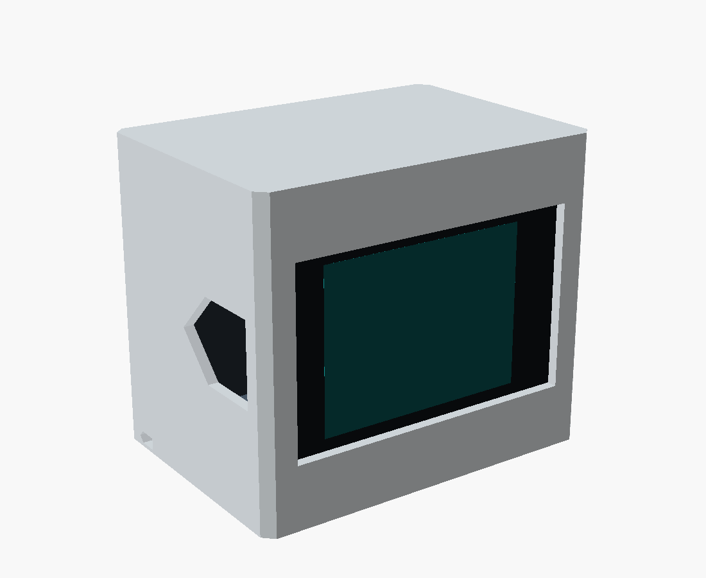

# HASS NFC Jukebox

**Karte auflegen, Hörbuch oder Musik hören.** Ein ESP32 mit NFC-Leser startet
Spotify auf einem ausgewählten Lautsprecher. Home Assistant verwaltet die Karten
und ordnet jedem Reader ein Spotify-Konto und einen Lautsprecher zu.

Das Projekt ist ein funktionierender Eigenbau, kein fertiges Plug-and-play-Produkt.
Die Oberfläche ist deutsch. **Das 3D-Gehäuse ist noch ein Prototyp mit bekannten
mechanischen Schwächen – bitte vor dem Drucken den Gehäuseabschnitt lesen.**

## Was funktioniert?

- Spotify-Alben, Playlists und einzelne Titel einer NFC-Karte zuordnen.
- Mehrere Karten als Stapel anlernen; Namen beim Start automatisch von Spotify laden.
- Gemeinsame Kartenbibliothek für mehrere Reader mit getrennten Konten/Lautsprechern.
- Karten suchen, sortieren, umbenennen, prüfen und Zuordnungen löschen/wiederherstellen.
- Hörbuch-Markierung: Shuffle wird vor dem Start aktiv ausgeschaltet und kontrolliert.
- Touchdisplay mit Titel, Interpret, Cover, Fortschritt, Play/Pause, Vor/Zurück und Seek.
- Native Home-Assistant-Seite mit **Anlernen | Gespeicherte Karten | Konfiguration**.

**Music Assistant ist nicht erforderlich.** Die Steuerung verwendet die native
Spotify-Integration von Home Assistant und Spotify Connect. Der Computer wird nur
für die Einrichtung gebraucht, nicht für den laufenden Betrieb.

## Hardware und Voraussetzungen

Der enthaltene Firmware-Entwurf ist für:

| Bauteil | Verwendetes Modell |
|---|---|
| Display/Controller | Waveshare ESP32-S3-Touch-LCD-2, ST7789, CST816D |
| NFC-Leser | RC522 / MFRC522 über SPI, Versorgung mit 3,3 V |
| Karten | RC522-kompatible 13,56-MHz-Karten/Tags, z. B. MIFARE Classic |
| Lautsprecher | Ein im gewählten Spotify-Konto verfügbares Spotify-Connect-Gerät |
| Steuerzentrale | Home Assistant mit nativer Spotify-Integration und ESPHome |

Entwickelt mit **ESPHome 2026.9.0**. Andere Displayplatinen, Touchcontroller und
RC522-Varianten sind nicht automatisch kompatibel. Die Kartenkennungen müssen
im Format `AA-BB-CC-DD` vorliegen (4–10 Bytes); beliebige UUID-Tags sind nicht
abgedeckt. Spotify-Wiedergabesteuerung setzt ein geeignetes Premium-Konto voraus.
Für unabhängige gleichzeitige Wiedergabe mehrere Spotify-Konten verwenden.

## Verkabelung

Diese Pins gelten für die oben genannte Waveshare-Platine:

| RC522 | ESP32 GPIO / Anschluss | Kabelfarbe im ursprünglichen Aufbau |
|---|---|---|
| SDA / SS | GPIO11 | Orange |
| SCK | GPIO14 | Grün |
| MOSI | GPIO13 | Rot |
| MISO | GPIO12 | Gelb |
| RST | GPIO15 | Blau |
| GND | GND | Schwarz |
| 3.3V | 3V3 | Weiß |
| IRQ | Nicht verbunden | – |

**SDA ist hier der SPI-Chip-Select, kein I²C-Anschluss.** RC522 mit 3,3 V betreiben.
Die Farben sind nur eine Merkhilfe; maßgeblich sind die Pinbeschriftungen.
Die verwendeten Pins dürfen nicht gleichzeitig für eine Kamera verwendet werden.

## Einrichtung

### 1. Spotify in Home Assistant einrichten

Richte die [native Spotify-Integration](https://www.home-assistant.io/integrations/spotify/)
für jedes gewünschte Konto ein. Prüfe zuerst in Home Assistant, dass dessen
`media_player` vorhanden ist und der Ziellautsprecher in der Quellenliste erscheint.
Falls Spotify den Lautsprecher noch nicht kennt, wähle ihn einmal in Spotify Connect.
Die jeweils aktuellen OAuth-/Developer-App-Vorgaben stehen in der verlinkten Anleitung.

### 2. Home-Assistant-Dateien kopieren

1. Aktiviere [Packages](https://www.home-assistant.io/docs/configuration/packages/),
   falls noch nicht vorhanden. In `configuration.yaml` unter dem vorhandenen
   `homeassistant:`-Abschnitt ergänzen, **keinen zweiten Abschnitt anlegen**:

   ```yaml
   homeassistant:
     packages: !include_dir_named packages
   ```

2. Kopiere [nfc_spotify.yaml](home_assistant/packages/nfc_spotify.yaml) nach
   `/config/packages/nfc_spotify.yaml`.
3. Kopiere [nfc-card-enroller.js](home_assistant/nfc_spotify/nfc-card-enroller.js)
   nach `/config/www/nfc/nfc-card-enroller.js`.
4. Die Skripte müssen über die HA-Skriptverwaltung gespeichert werden können.
   Die übliche Einbindung lautet `script: !include scripts.yaml`.
5. Prüfe die HA-Konfiguration. Wenn Packages gerade erst aktiviert wurden,
   starte Home Assistant einmal neu.

### 3. Skripte und Dashboard installieren

Auf deinem Computer: Python 3.10+ installieren, Repository herunterladen und im
Repository-Verzeichnis ausführen:

```sh
python -m pip install -r tools/requirements.txt
python tools/install.py --url http://homeassistant.local:8123
```

Verwende deine erreichbare HA-Adresse. Der Helfer fragt verdeckt nach einem
langfristigen Zugriffstoken eines HA-Administrators. Er benötigt den Token nur
während der Installation und speichert ihn nicht. Alternativ sind `HA_URL` und
`HA_TOKEN` als Umgebungsvariablen möglich.

Der Helfer erstellt die vier fehlenden Skripte, lädt die Konfiguration neu und
legt das Dashboard **NFC Karten** an. Bereits vorhandene Skripte und Dashboard-
Inhalte werden nicht überschrieben. Kartenbibliothek und Reader-Profile starten
leer. Aufruf danach: `/nfc-karten/anlernen`.

Das ist ein **Erstinstallationshelfer**, kein Migrationsprogramm: Bestehende
Installationen vor einem Versionswechsel sichern und Änderungen prüfen.

### 4. ESPHome-Panel einrichten

1. Kopiere `esphome/nfc_spotify_player.yaml` und `esphome/components/` in dein
   ESPHome-Konfigurationsverzeichnis; der relative Komponentenpfad muss passen.
2. Übernimm die Einträge aus [secrets.example.yaml](esphome/secrets.example.yaml)
   in deine lokale `secrets.yaml`: WLAN, API-Verschlüsselungsschlüssel, OTA-Passwort.
   Die echte Datei niemals veröffentlichen.
3. Passe oben in der YAML `device_name`, `friendly_name` und
   `home_assistant_url` an. Die HA-Adresse muss **vom ESP erreichbar** sein.
4. Ersten Flash über USB durchführen und das Gerät in Home Assistant über ESPHome
   hinzufügen. Den konfigurierten API-Schlüssel verwenden.
5. Öffne das Gerät in HA: Die URL endet auf `/config/devices/device/<ID>`.
   Diese **HA-Geräte-ID** kommt in die Firmware-Substitution `reader_id`.
   Sie ist weder die MAC-Adresse noch die Karten-UID. Firmware danach erneut laden.
6. Aktiviere beim ESPHome-Gerät in HA die Option, **Home-Assistant-Aktionen
   auszuführen**; sonst können Kartenscans/Tasten keine HA-Aktionen auslösen.

Ein weiterer identischer Display-Reader braucht einen eigenen Gerätenamen und
seine eigene `reader_id`. Spätere Konto-/Lautsprecherwechsel erfolgen im Dashboard
und brauchen keinen weiteren Flash. Andere NFC-Reader ohne Display können genutzt
werden, wenn sie passende `tag_scanned`-Events mit ihrer HA-Geräte-ID senden.

### 5. Reader koppeln

Unter **NFC Karten → Konfiguration → Weiteren Reader koppeln**:

1. NFC-Lesegerät auswählen und benennen.
2. Spotify-Player/Konto auswählen.
3. Ziellautsprecher auswählen.
4. Standardtyp für neue Karten und Shuffle-Verhalten für Musik einstellen.
5. **Kopplung speichern**.

Fehlt der Reader in der Auswahl, scanne einmal eine Karte damit und lade die
Seite neu. Ein Reader ohne Profil startet keine Musik. Dieselbe Karte spielt an
verschiedenen Readern denselben Inhalt über deren jeweilige Kopplung.

## Karten anlernen und verwalten

1. Oben den gewünschten Reader auswählen.
2. In **Anlernen** einen Spotify-Link pro Zeile einfügen.
3. **Anlernen starten** lädt die Namen. Optional ersetzt `Eigener Titel | Link`
   den Spotify-Namen. Ein Albumlink startet das ganze Album, nicht nur den darin
   markierten `highlight`-Titel.
4. Karten nacheinander auflegen und jeweils wieder abnehmen. Den Typ pro Eintrag
   bei Bedarf auf **Hörbuch** ändern.
5. **Stapel speichern**, sobald alle Einträge eine UID haben.

Während des Anlernens starten Scans dieses Readers keine Wiedergabe. Andere Reader
bleiben nutzbar. Der Entwurf bleibt beim Beenden und Tabwechsel erhalten.
Bereits gespeicherte Karten werden nur nach ausdrücklicher Neuzuordnung ersetzt.

In **Gespeicherte Karten**: Suche nach UID/Titel/Typ, Sortierung, Stift zum Umbenennen,
Link zu Spotify, rotes × zum Entfernen der Zuordnung. **Löschen rückgängig** gilt
im selben Browser; die Karte selbst wird weder beschrieben noch gelöscht.
**Karten prüfen** zeigt UID und Titel, ohne Musik zu starten.

## 3D-Gehäuse: bekannter Prototyp



70 × 50 × 60 mm, Display vorne, Kartenleser oben, PLA, ohne Schrauben.
[CAD, STL und Druckhinweise für rB](enclosure/rB/LESEN.md) sind enthalten;
r0/rA bleiben als ältere Entwürfe nachvollziehbar.

**Der physische Test von rB hat folgende Probleme gezeigt:**

- Displaystützen brechen leicht ab.
- Rastmechanismus hält zu schwach.
- Rückwand wird unzureichend gehalten.
- Display hat Spiel nach hinten und wippt.

Die STL-Prüfung auf geschlossene Netze war erfolgreich, ersetzt aber keine
mechanische Erprobung. **rC mit stabileren Auflagen, besserer Rückwandführung und
justierbarer Displayklemmung ist bisher nur geplant, nicht konstruiert.**

## Grenzen und Fehlerbehebung

- Nur ein physischer Reader wurde bisher erprobt. Mehrere Profile, die getrennten
  Anlernsperren und die Zuordnungslogik sind implementiert/getestet; gleichzeitige
  Wiedergabe mit zwei echten Readern ist noch nicht praktisch verifiziert.
- Spotify/HA-Rückmeldungen sind nicht verzögerungsfrei. Die Fortschrittsanzeige
  rechnet zwischen Positionsmeldungen lokal weiter.
- Der lokale Touch-Treiber filtert unplausible Rohwerte. Er behebt nicht nachweislich
  deren elektrische Ursache und erkennt nicht jeden möglichen Ghost-Touch.
- Keine automatische Hörbuch-Fortsetzung über mehrere Kartenwechsel hinweg.
- Fehlende Lautsprecher: zuerst Konto und Spotify-Connect-Verfügbarkeit prüfen.
- Kein Scan: Stromversorgung, SPI-Verkabelung und ESPHome-Logs prüfen; anschließend
  Geräte-ID und Reader-Profil. Keine beliebigen 125-kHz-Tags verwenden.
- Veraltete Oberfläche: Browser neu laden. Bei Updates muss der Ressourcen-URL
  ein neuer Versionsparameter mitgegeben werden; der Installationshelfer tut dies.
- Ein abgebrochener Anlernmodus läuft spätestens nach 90 Sekunden aus.
- Gleichzeitiges Speichern aus mehreren Admin-Seiten vermeiden; die HA-Konfigurations-
  API bietet keine atomare Versionsprüfung.

## Entwicklung, Aufbau und Lizenz

```sh
node home_assistant/nfc_spotify/test_card.cjs
python -m unittest discover -s tools -p "test_*.py"
```

[Architektur und Datenablage](docs/ARCHITECTURE.md) ·
[MIT-Lizenz](LICENSE) · [Drittanbieter-Lizenzen](THIRD_PARTY_NOTICES.md)

Eigener Projektcode, Dokumentation und CAD stehen unter MIT. **Ausnahme:** Der
übernommene ESPHome-C++-Touch-Treiber bleibt GPLv3; dessen Python-Dateien sind MIT.
Es werden keine Zugangsdaten, privaten Kartenlisten oder vorkompilierten
Firmwaredateien mitgeliefert.
