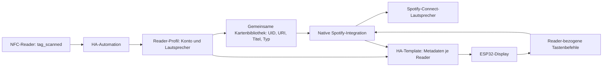

# Architektur

## Datenfluss

## Dateien und aktive Daten

| Bestandteil | Ort in Home Assistant |
|---|---|
| Karten | `script.nfc_jukebox_play_card`, `variables.card_map` |
| Reader-Profile | `script.nfc_jukebox_reader_config`, `variables.profiles` |
| Scan-Weiterleitung, Startautomatik, Template-Sensoren | `/config/packages/nfc_spotify.yaml` |
| Oberfläche | `/config/www/nfc/nfc-card-enroller.js` |
| Dashboard | HA Lovelace Storage, URL `/nfc-karten/anlernen` |
| Entwürfe | Browser-localStorage, nach Reader getrennt |
| Löschhistorie / letzte Sicherung | Browser-localStorage |

Die JSON-Dateien im Repository sind **leere Installationsvorlagen**, keine
Synchronisation der produktiven Daten. Nach Einrichtung bleiben Konten und
Karten ausschließlich in der jeweiligen Home-Assistant-Installation.

Der Konfigurationsskript-Aufruf veröffentlicht ein Event. Der Trigger-Template-
Sensor `sensor.nfc_jukebox_profiles` hält die Profile zur Laufzeit und stellt sie
nach Neustarts wieder her; zusätzlich veröffentlicht die Startautomation die
persistierte Skriptkonfiguration neu. Profiländerungen werden gespeichert,
zurückgelesen und anschließend veröffentlicht.

`sensor.nfc_jukebox_runtime` erzeugt ein `NFC:`-präfigiertes JSON-Attribut für alle
Reader. Jedes Display wählt daraus nur seine feste Hardware-Reader-ID. Bei einer
anderen aktiven Quelle des Spotify-Players zeigt das Panel keinen fremden Titel
und seine Tasten steuern diesen Player nicht. Cover-Downloads verwenden weiterhin
die HA-Proxy-Adresse beziehungsweise die von HA gelieferte Bild-URL.

Die Wiedergabe wird parallel ausgeführt; verschiedene Reader brechen einander
nicht ab. Ein Spotify-Konto bleibt allerdings eine gemeinsame Wiedergabesitzung:
Zwei Profile mit demselben Konto ergeben keine zwei unabhängigen Streams.

## Schutz vor Fehlzuordnung

- Unbekannte Reader/UIDs oder ungültige Spotify-URIs starten keine Wiedergabe.
- Anlern-/Prüfsperren liegen in `sensor.nfc_jukebox_sessions`, nach Reader getrennt.
  Sie werden für maximal 90 Sekunden gesetzt und regelmäßig erneuert.
- Tasten akzeptieren nur vorheriger Titel, Play/Pause, nächster Titel und Seek.
- Änderungen an Karten und Profilen erhalten fremde Konfigurationseinträge.
  Eine erneute Prüfung vor dem Schreiben erkennt zwischenzeitliche Änderungen;
  eine vollständig atomare Compare-and-swap-Operation bietet die HA-API nicht.
- Namen werden als Text ausgegeben und dürfen keine Jinja-Klammern enthalten.
- Öffentliche Spotify-oEmbed-Anfragen benötigen keine Spotify-Zugangsdaten.

## Firmware und Gehäuse

Die Firmware enthält die GPIO-/Display-Konfiguration und eine Reader-ID, aber
keine fest verdrahtete Spotify-Konto- oder Lautsprecher-Zuordnung. Der lokale
CST816-Patch ist unter [esphome/components/cst816](../esphome/components/cst816/README.md)
dokumentiert. Verbindungsdaten gehören in ESPHome secrets.

`enclosure/r0`, `rA`, `rB` enthalten OpenSCAD-Quellen, STL und geometrische Prüfungen.
Die mechanischen Probleme von rB stehen ausdrücklich in der Haupt-README.
Ein rC-Entwurf ist nicht Bestandteil dieses Releases.
