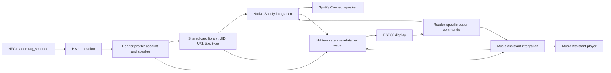

# Architecture

## Data flow

## Files and active data

| Component | Location in Home Assistant |
|---|---|
| Cards | `script.nfc_jukebox_play_card`, `variables.card_map` |
| Reader profiles | `script.nfc_jukebox_reader_config`, `variables.profiles` |
| Scan routing, startup automation, template sensors | `/config/packages/nfc_spotify.yaml` |
| Dashboard UI | `/config/www/nfc/nfc-card-enroller.js` |
| Dashboard | HA Lovelace storage, URL `/nfc-cards/enroll` |
| Drafts | Browser localStorage, separated by reader |
| Deletion history / latest backup | Browser localStorage |

Repository JSON files are **empty installation templates**, not synchronized
production data. Accounts and cards remain inside the user's Home Assistant
installation after setup. Existing technical entity IDs, event names, storage keys
are retained for compatibility; new dashboards use an English route. The installer
also recognizes and preserves the original dashboard route. Visible labels are English.

Calling the configuration script publishes an event. The trigger-based template
sensor `sensor.nfc_jukebox_profiles` holds profiles at runtime and restores them
after restart. The startup automation also republishes the persisted script
configuration. Profile updates are saved, read back and then published.

`sensor.nfc_jukebox_runtime` generates a JSON attribute prefixed with `NFC:` for all
readers. Each display selects its fixed hardware reader ID. When a Spotify player
has a different active source, the panel does not show that source's track or
control its playback. Cover downloads use Home Assistant's proxy address or the
image URL provided by Home Assistant.

Playback scripts run in parallel so different readers do not cancel one another.
A Spotify account still represents one shared playback session: two profiles using
the same account do not provide two independent streams.

Profiles use `backend: spotify` (also the default for old profiles) or
`backend: music_assistant`. Spotify profiles retain `player` plus a Connect `source`.
Music Assistant profiles store the target MA entity in `player`; `source` is empty.
They call `music_assistant.play_media` with a Spotify URL and `enqueue: replace`.
Playback controls and metadata use that same MA entity, without a Spotify source
comparison. Unavailable MA players are not treated as matched. Provider accounts
and provider selection remain configured in Music Assistant. Audiobooks explicitly
disable shuffle and wait up to ten seconds for MA to confirm before starting.

For an existing installation, update the play-card and control script logic and
the package runtime template along with the JavaScript. Preserve the live
`variables.card_map` and reader profiles; do not overwrite them with empty repository
templates. The installer intentionally does not replace existing scripts.

## Mapping safeguards

- Unknown readers/UIDs and invalid Spotify URIs do not start playback.
- Enrollment/inspection leases are stored per reader in `sensor.nfc_jukebox_sessions`.
  They last at most 90 seconds and are renewed while the page is active.
- Controls accept only previous track, play/pause, next track and seek.
- Card/profile changes preserve unrelated configuration entries. A read before
  writing detects intervening changes, but the Home Assistant API does not provide
  a fully atomic compare-and-swap operation.
- Titles are rendered as text and cannot contain Jinja braces.
- Public Spotify oEmbed requests do not require Spotify credentials.

## Firmware and enclosure

Firmware holds GPIO/display settings and a reader ID, without hard-coded account
or speaker mappings. The local [CST816 patch](../esphome/components/cst816/README.md)
is documented separately. Connection credentials belong in ESPHome secrets.

The backlight turns off after 60 seconds without touch, detected movement or a new
card scan. Playback and network/NFC/touch processing continue. The QMI8658 is sampled
at 50 ms intervals; a 0.18 g vector deviation from a moving baseline counts as
movement. Initial samples and non-finite values do not trigger wake. Touch wakes
before button listeners run; the whole wake gesture is blocked from playback
commands, including seeking. A 500 ms guard also covers a touch immediately after
motion wake. Metadata and track changes do not refresh the activity timer. This
addition has compiled successfully but still needs physical testing.

`enclosure/r0`, `rA`, `rB` and `rC` include OpenSCAD sources, STL files and geometric
checks. rB's physical test exposed weak supports and catches. rC introduces broad
supports, replaceable display clamp strips and four removable locking keys; it is
geometrically checked but has not been printed or mechanically tested.

## Audiobook persistence

`nfc_audiobook` is a YAML custom integration. The play-card script calls its
`prepare` action after validating the reader, enrollment lease and card URI. Music
continues through the existing script; audiobooks are handled by the component.
`choose` consumes a request ID so stale display taps cannot start a newer card.
The server stores bookmarks and active tracking in HA Store (`nfc_audiobook`,
version 1). Pending dialogs are transient. Keys include listener/account, card UID
and context URI; remapping a card cannot reuse the previous content bookmark.
Spotify context/source and MA queue-item IDs guard against unrelated playback
overwriting a bookmark. HA state `sensor.nfc_audiobook` exposes pending dialogs,
active card names and errors; firmware subscribes to `displays_json`.
