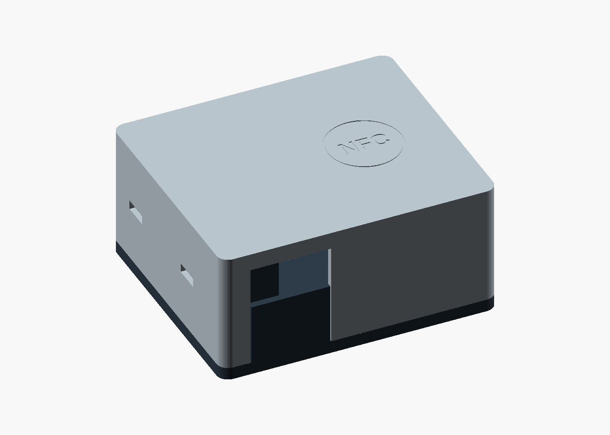
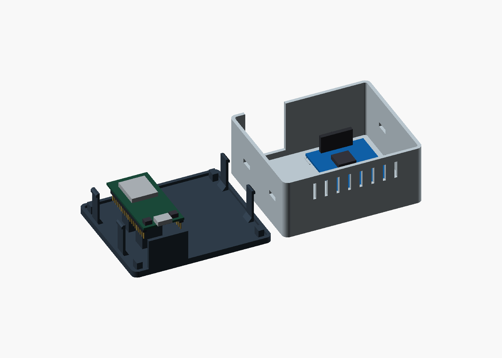
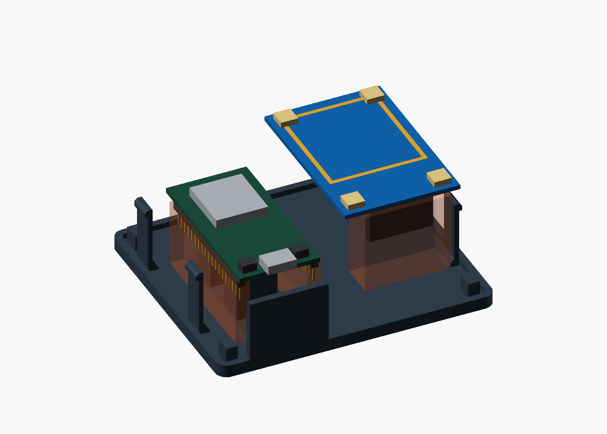
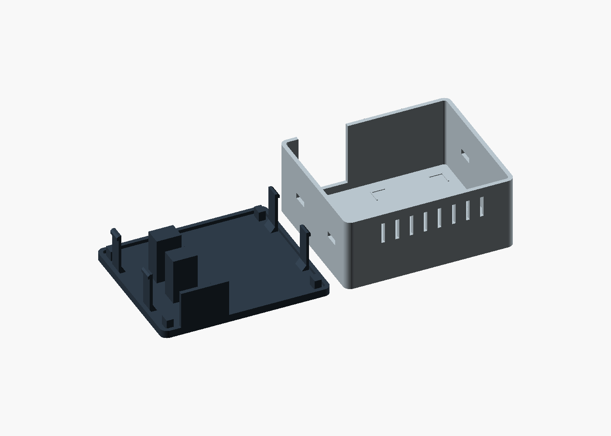

# Headless ESP32-WROOM enclosure — r0

Archived revision. Use [rA](../rA/README.md) for printed PCB clips and supports.

**96 × 82 × 46 mm**, PLA, two printed parts. An AZ-Delivery ESP32 Dev Kit C V4
sits on the base; an RC522 mounts beneath the card target on the cover.
Four releasable latches connect the housing halves. Foam adhesive pads retain
the electronics independently of the housing closure.



## Parts

| Item | Quantity | Specification |
|---|---:|---|
| [base.stl](base.stl) | 1 | Floor, PCB supports and four latches |
| [cover.stl](cover.stl) | 1 | Cover, USB opening and NFC target |
| Double-sided foam adhesive | 2 pads | 14 × 10 × **1 mm**, ESP32 supports |
| Double-sided foam adhesive | 4 pads | 6 × 6 × **2 mm**, RC522 antenna face |

Use nonconductive foam adhesive without metallic backing. PCB mounting uses
adhesive pads; the printed latches secure the housing only. Screws are not required.

## Board layout and clearance

| Item | CAD envelope / clearance |
|---|---|
| ESP32 Dev Kit C V4 | 55 × 28 mm; PCB thickness 1.6 mm |
| ESP32 orientation | Components upward; header pins downward; USB at the front |
| ESP32 supports | Two 14 × 10 mm surfaces under the PCB center, between the header rows |
| ESP32 plugs and wire bends | 23.6 mm below the PCB along both header rows |
| ESP32 upper components and buttons | 8 mm above the PCB; no cover contact |
| RC522 | 60 × 40 × 1.6 mm PCB; components face inward |
| RC522 connector space | 30 × 12 × 27.8 mm below the front connector area |
| RC522 antenna-to-roof spacing | 2 mm foam pads |
| Roof | 1.6 mm; 1.3 mm at the shallow NFC marking |
| USB opening, assembled | 28 × 14.4 mm; checked plug envelope 24 × 12 mm |

The board dimensions are design envelopes for the standard modules. The
[AZ-Delivery product](https://www.az-delivery.de/products/esp-32-dev-kit-c-v4)
uses the Espressif DevKitC layout. The
[Espressif drawing](https://dl.espressif.com/dl/schematics/esp32_devkitc_v4_dimensions.pdf)
provides the PCB outline, module overhang and header spacing. The RC522 footprint
follows the [Joy-IT module specification](https://joy-it.net/en/products/SBC-RFID-RC522).
Both boards mount without using PCB hole positions.



## Assembly

1. Put a 1 mm adhesive pad on each of the two broad supports. Position the ESP32
   with the USB end at the front opening, components upward and pins downward.
   The supports contact the flat underside between the header rows. Boot and
   Reset are on the accessible upper face.
2. Connect the wires with the cover removed. Both header rows are accessible
   from the sides. The orange volumes in the clearance view below show the
   reserved connector and wire space.
3. Place four 2 mm pads on the flat antenna face of the RC522, 2 mm inward from
   each PCB corner. With the cover upside down, align the reader with the four
   corner marks inside the roof. The components face into the enclosure and
   the connector faces the USB side. Press over the pads to bond the board.
4. Connect the RC522. Keep approximately 60 mm of additional wire as a service
   loop in the free floor area, so the cover can lift before disconnecting it.
5. Lower the cover vertically. Its rim seats on the base; all four noses engage
   the side windows. The electronics are clear of this closing path.

To open, press the two latch noses on one side inward and lift that side slightly;
release the other pair and lift the cover. The RC522 stays attached to the cover.
Boot and Reset are reached with the cover removed.



## Printing

The STL files already have their print orientations: base floor down, cover roof
down. PLA, 0.4 mm nozzle, 0.2 mm layers, four perimeters and 20–30% infill.
The layout fits a 200 × 82 mm rectangle before brim or skirt.



The geometry is intended for printing without supports. The latch shoulders
project 1.02 mm; the side windows have 9.2 mm bridges. The USB cutout is open in
the printing direction. The latches have 0.6 mm nominal closing deflection and
0.2 mm vertical clearance at their retaining shoulders.

## CAD and verification

[jukebox.scad](jukebox.scad) contains the enclosure, hardware envelopes and views.
[mesh-check.json](mesh-check.json) records manifold checks, assembled shell and
hardware clearances, and 51 cover-lift positions after latch release. These checks
cover nominal geometry; printed fit, latch strength and adhesive retention require
a physical assembly.

```sh
python build.py --openscad openscad
python -m pip install trimesh numpy scipy manifold3d
python verify_meshes.py
```

Original CAD and documentation: MIT.
