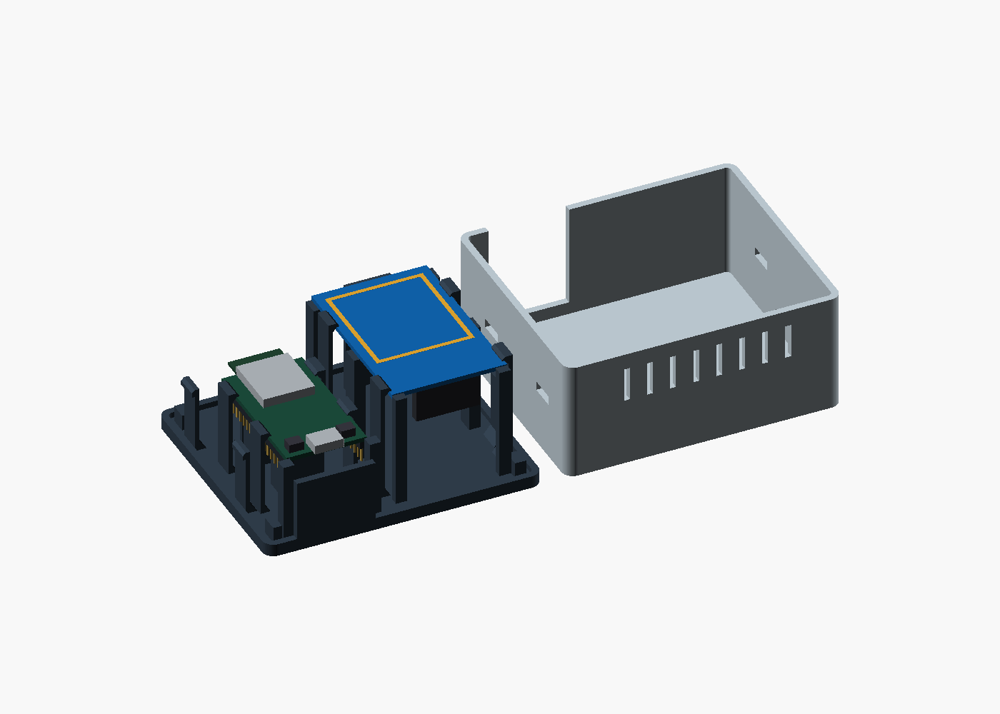
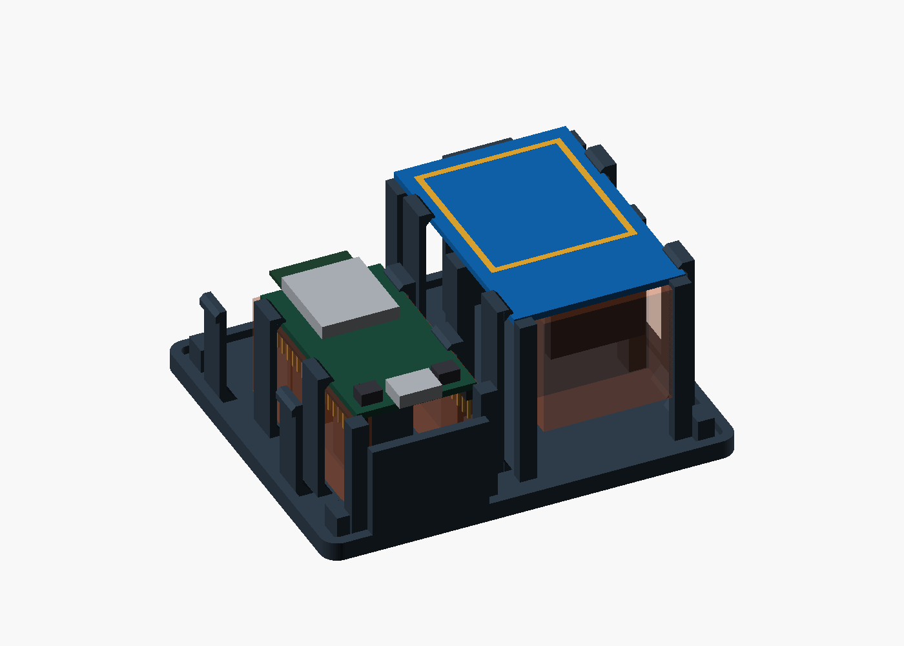
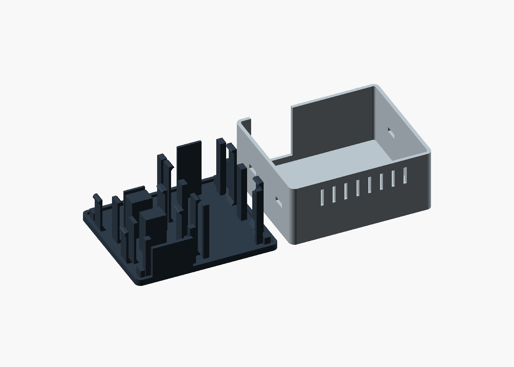

# Headless ESP32-WROOM enclosure — rA

**96 × 82 × 46 mm**, PLA, two printed parts. Four edge clips retain each PCB
on the base. Four separate housing latches secure the removable cover.
All fasteners and PCB supports are part of the print.



## Parts and assembly

Print one [base.stl](base.stl) and one [cover.stl](cover.stl).

1. Connect the jumper wires while both boards are outside the enclosure.
2. Place the ESP32 on the two broad central supports, components up, pins down,
   USB toward the front opening. Press its PCB edges past the four ramped clips.
   The clip shoulders capture 0.8 mm of each long edge. Front stops and a flexible
   rear stop locate the board lengthwise. Boot and Reset remain accessible.
3. Place the RC522 on its four edge supports, antenna up, components down,
   connector toward the front. Engage its four clips in the same way.
4. Route the wires into the free space under and between the boards. Lower the
   cover until the four housing latches engage. Both boards stay on the base.

To remove a board, pull its two clips on one side outward, lift that PCB edge,
then release the opposite side. Press the housing latch noses through the side
windows to remove the cover. The cover seats on the base rim independently of
the PCB retainers.

## Dimensions

| Item | Nominal dimensions / clearance |
|---|---|
| ESP32 DevKitC V4 PCB | 48.26 × 27.94 × 1.6 mm |
| ESP32 RF antenna overhang | 6.04 mm beyond the PCB; above the rear stop |
| ESP32 underside support | Two 14 × 10 mm surfaces between the header rows |
| ESP32 plugs and wire bends | 23.6 mm below the PCB along both header rows |
| ESP32 top component envelope | 8 mm high; outer 1 mm edge strips reserved for clips |
| RC522 PCB | 60 × 40 × 1.6 mm |
| RC522 underside support | Four 2 × 6 mm contact areas on the long PCB edges |
| RC522 component envelope | 8 mm deep; outer 2 mm strips reserved for supports |
| RC522 plugs and wire bends | 30 × 12 × 27.8 mm at the connector end |
| Antenna-to-roof air gap | 2 mm |
| Roof | 1.6 mm; 1.3 mm at the NFC marking |
| USB opening | 28 × 14.4 mm; checked plug envelope 24 × 12 mm |

The ESP32 PCB outline and overhang follow the
[Espressif DevKitC V4 drawing](https://dl.espressif.com/dl/schematics/esp32_devkitc_v4_dimensions.pdf).
[AZ-Delivery](https://www.az-delivery.de/products/esp-32-dev-kit-c-v4) identifies
its V4 board with this layout. The RC522 footprint follows the
[Joy-IT module specification](https://joy-it.net/en/products/SBC-RFID-RC522).
`esp_w`, `esp_l`, `rc_w`, `rc_l` and `pcb_t` identify the nominal board sizes in
the CAD. The supplied STL files use the dimensions above.



## Printing

The STL orientations are ready for printing: base floor down, cover roof down.
PLA, 0.4 mm nozzle, 0.2 mm layers, four perimeters and 20–30% infill.
Both parts occupy a 200 × 82 mm rectangle before brim or skirt.



Sloping PCB clip shoulders limit the final horizontal hook projection to 0.8 mm.
The housing latch shoulders project 1.02 mm; side windows bridge 9.2 mm.
The USB cutout is open in the printing direction. PCB clips have 8 mm-wide,
1.6 mm-thick leaves and a nominal 1.6 mm capture height. Housing latches have
0.6 mm nominal deflection and 0.2 mm vertical retaining clearance.

## Verification and rebuild

[mesh-check.json](mesh-check.json) records closed, connected print meshes,
hardware/connector clearances, PCB capture in all six translation directions,
and 51 cover-lift positions with released housing latches. The checks describe
nominal geometry; printed fit and retention force require a physical assembly.

```sh
python build.py --openscad openscad
python -m pip install trimesh numpy scipy manifold3d
python verify_meshes.py
```

[jukebox.scad](jukebox.scad) contains the model and assembly views.
Original CAD and documentation: MIT.
