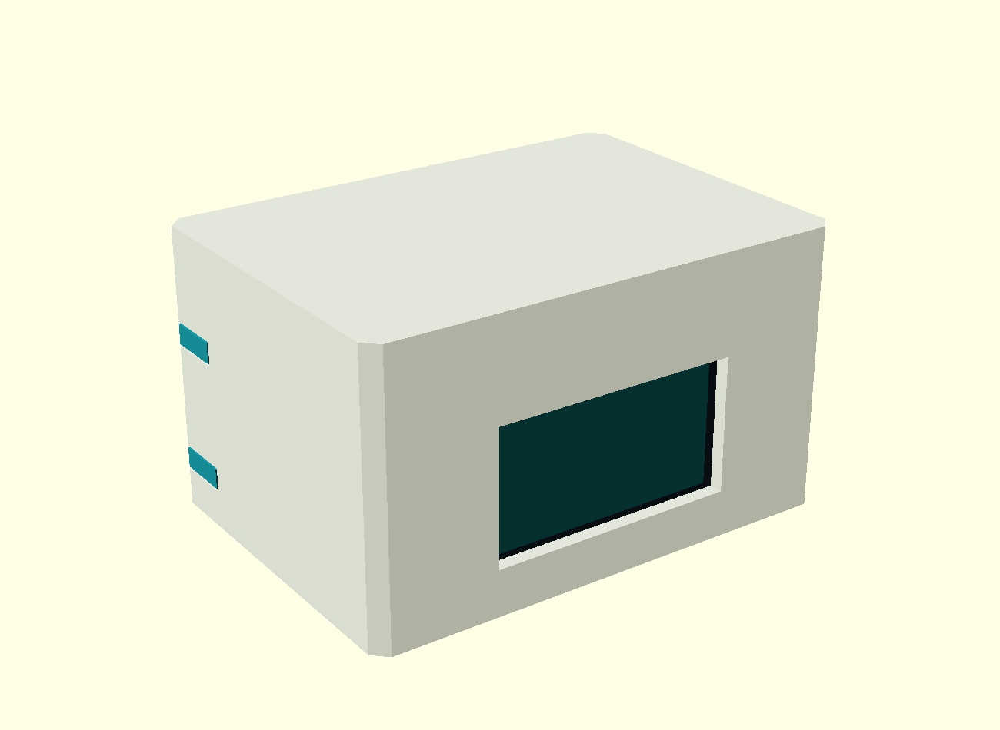
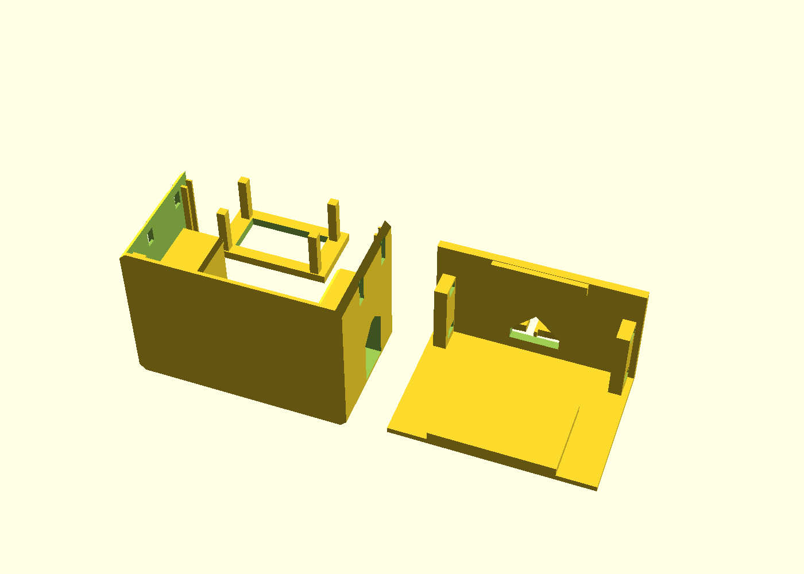
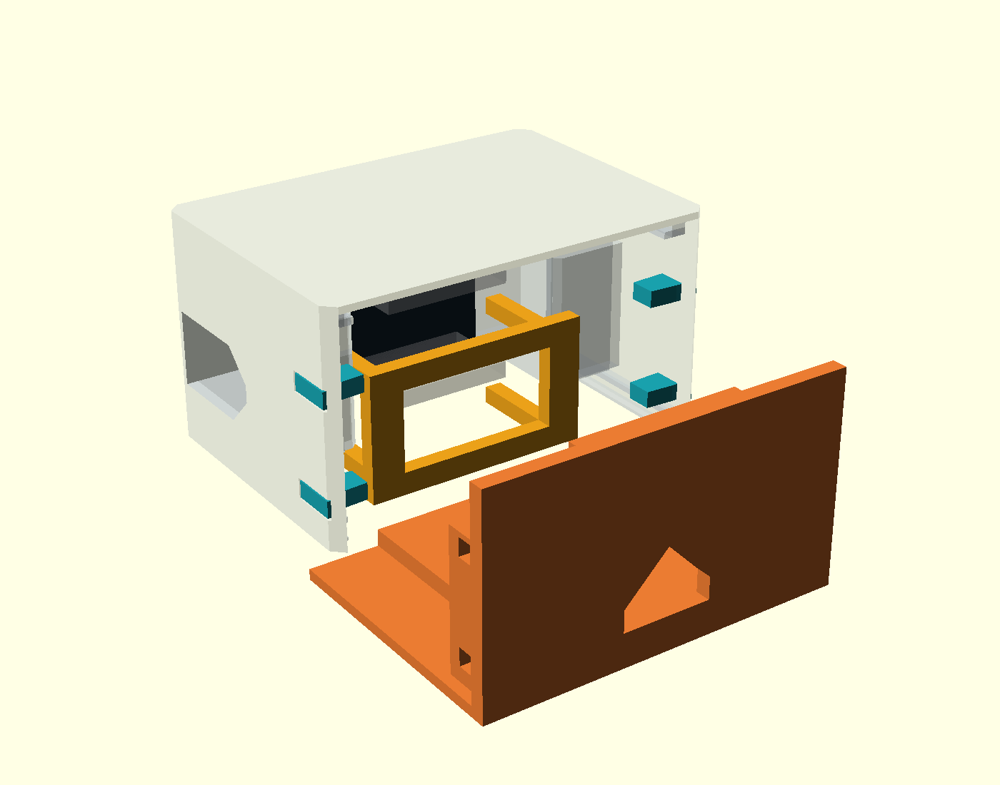

# Flat office enclosure — 1.47B-M, r0

**Prototype: geometrically checked, not physically printed or fitted.**
Overall size: **70 × 50 × 40 mm** (width × depth × height). One third lower than
the 60 mm enclosure for the 2-inch display. PLA, no screws; display at the front,
RC522 antenna under the roof. USB faces right when looking at the display.



## Parts and print orientation

| File | Quantity / purpose |
|---|---|
| `body.stl` | One shell, already front-face down |
| `drawer.stl` | One floor/rear panel, already floor down |
| `retainer.stl` | One display retainer for a **7 mm** module depth |
| `retainer-4mm.stl` | Alternative for a 4 mm module |
| `retainer-5mm.stl` | Alternative for a 5 mm module |
| `retainer-6mm.stl` | Alternative for a 6 mm module |
| `retainer-8mm.stl` | Alternative for an 8 mm module |
| `keys.stl` | Four keys in one file, already laid flat |

**Use one retainer only.** Module depth means display front to rear PCB, excluding
header pins, sockets and wires. The manufacturer drawing does not specify this
dimension. Measure it to choose a retainer. The default 7 mm is an assumption,
not a measured dimension. In `jukebox.scad`, `module_depth` accepts intermediate
values too. A larger value shortens the four columns and leaves more room for a
thicker module. Do not force a too-long retainer against the display.



Starting settings: PLA, 0.4 mm nozzle, 0.2 mm layers, four walls, five top/bottom
layers, 20–30% infill. Print the retainer on its broad rear frame, columns upward;
the STL already has this orientation. This loads the columns in compression when
assembled, instead of using thin flexible display fingers.

The body has local rear-stop lips projecting about 1.3 mm and short bridges at the
key holes / USB opening. Drawer key holes bridge about 5.2 mm. Start with supports
off and inspect the slicer preview; this is not a verified support-free print.
No broad bridge crosses the front display opening in the supplied orientation.

## Assembly



1. Lay the body front-face down on a soft surface. Leave the drawer and keys out.
2. Slide the display module upward through the open bottom, screen toward the
   front bezel and USB connector toward the right-side opening.
3. Slide the selected retainer upward behind it. The **four column ends face the
   back of the module**, contacting its corner areas. The broad frame is behind
   the header connectors and seats against the body stops. There are no diagonal
   clamp strips in this design.
4. Plug in the RC522 wires. Route the header sockets and wires through the open
   retainer center. Test the actual USB cable through the recessed side opening.
5. Slide the RC522 in from the rear, antenna upward, components and wires downward.
6. Slide the drawer in. Its broad cradle supports the display and retainer from
   below; its rear stop retains the RC522.
7. Push the four keys in from the sides, tapered ends first, until their heads sit
   in the recesses. To reopen, extract the keys and pull out the drawer.

## Dimensions and limits

The Waveshare board footprint is **36.37 × 20.32 mm**, from the
[manufacturer drawing](https://www.waveshare.com/img/devkit/ESP32-S3-LCD-1.47B/ESP32-S3-LCD-1.47B-details-size.jpg).
The centered front window, front stack thickness, LCD active-area position,
header/socket envelope and corner contact areas are provisional. The actual
module must be checked; PCB dimensions alone do not prove its glass or stack fit.

RC522 assumption: 60 × 40 × 1.6 mm PCB. The 1.2 mm roof leaves 0.8 mm above the PCB.
A 7 mm underside component envelope is reserved away from the PCB edges. Actual
solder joints, strain relief and wire bends may need more room. The USB opening
admits a plug housing, but the socket is recessed; unusually wide/short housings
may not fit. No battery is included in this design.

`verify_meshes.py` checks the eight printable STL files for watertightness,
consistent winding, positive volume, expected connected parts and bed contact.
It checks 101 drawer positions, bottom insertion of all five retainer sizes,
nominal module/header envelopes, RC522 PCB and its assumed component clearance.
Results are in [mesh-check.json](mesh-check.json). No measured retention force,
RF performance, physical fit or durability result is claimed.

## Rebuild

```sh
openscad -D 'part="body"' -o body.stl jukebox.scad
openscad -D 'part="drawer"' -o drawer.stl jukebox.scad
openscad -D 'part="retainer"' -D 'module_depth=7' -o retainer.stl jukebox.scad
openscad -D 'part="keys"' -o keys.stl jukebox.scad
python -m pip install trimesh numpy scipy manifold3d
python verify_meshes.py
```

The geometry verification also requires the four alternative retainer exports.
Original CAD design: MIT. Manufacturer drawings are references, not redistributed.
