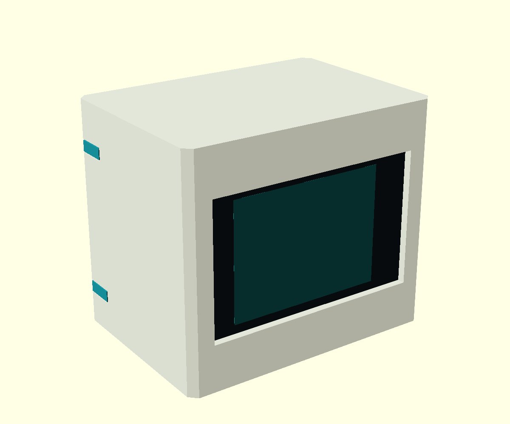

# NFC-Jukebox – Gehäuse rC

**Überarbeiteter, noch nicht physisch erprobter Entwurf.** Außenmaß weiterhin
70 × 50 × 60 mm (Breite × Tiefe × Höhe), Display vorne, RC522 oben, PLA, ohne Schrauben.
USB-Ausschnitt nur rechts (von vorne aufs Display gesehen); links geschlossen.
Gehäuse und Einschub zusammen neu drucken: rB und rC sind mechanisch nicht kompatibel.



## Was gegenüber rB anders ist

- Durchgehende, mit den Seitenwänden verbundene Displayführungen. Die hinteren
  Halteleisten überdecken ca. 3,2 mm des äußeren Glasrandes statt ca. 0,9 mm.
- Breiter Sockel unter dem Display statt zwei dünner Stützfinger: ca. 58,4 mm breit
  und 7,7 mm tief, direkt mit dem Boden verbunden.
- Zwei separate Passleisten hinter den seitlichen Glasrändern begrenzen das
  Spiel nach hinten. Drei Dicken ermöglichen die Anpassung, ohne das Gehäuse neu
  zu drucken. Sie liegen außerhalb der nominalen Displayplatine.
- Vier massive, seitlich eingesteckte Riegel halten den Einschub oben und unten.
  Durchgehende Rippen verbinden deren Aufnahmen mit Boden und Rückwand.
  Die Riegel tragen die Auszugskraft quer zu ihrer Einsteckrichtung; ihre leichte
  Presspassung hält sie seitlich im Loch. Keine federnden PLA-Rastarme mehr.

## Druckteile

| Datei | Inhalt / Verwendung |
|---|---|
| [gehaeuse.stl](gehaeuse.stl) | 1 Gehäuse, Front bereits auf dem Druckbett |
| [einschub.stl](einschub.stl) | 1 Boden mit Rückwand, Boden bereits unten |
| [riegel.stl](riegel.stl) | 4 gleiche Riegel, bereits flach angeordnet |
| [klemmleisten-normal.stl](klemmleisten-normal.stl) | 1 linke + 1 rechte Leiste, nominal 0,15 mm Restspiel |
| [klemmleisten-eng.stl](klemmleisten-eng.stl) | Alternative: nominal 0 mm Restspiel, dickere Leisten |
| [klemmleisten-lose.stl](klemmleisten-lose.stl) | Alternative: nominal 0,30 mm Restspiel, dünnere Leisten |
| [riegel-lose.stl](riegel-lose.stl) | Alternative bei zu strammen Riegeln, Schaft bis 0,15 mm schmaler |

**Jeweils nur einen Leisten- und einen Riegelsatz verwenden.** Die STL-Dateien
sind bereits in Drucklage; keine automatische Neuausrichtung nötig.
Ausgangswerte: PLA, 0,4-mm-Düse, 0,2-mm-Schichten, 4 Wandlinien, 5 Boden-/Decklagen,
20–30 % Infill. Leisten und Riegel werden bei diesen Wandstärken weitgehend massiv.
Keine Skalierung zum Einstellen der Passung verwenden; sie verändert auch die
Hardwaremaße.


Die Schrägen wachsen überwiegend mit 45°. An den vier Riegellöchern bleiben kurze
Brücken: im Gehäuse ca. 3,2–3,5 mm, im Einschub ca. 5,2 mm. Der Entwurf ist auf
Drucken ohne Supports ausgelegt; diese kurzen Brücken und die erste Schicht in
der Slicer-Vorschau prüfen. Das ist keine Zusage für jeden Drucker. Für kleine
Leisten bei Bedarf einen außenliegenden Brim verwenden.

## Montage


1. Gehäuse mit der Front auf eine weiche Unterlage legen. Riegel noch nicht einsetzen.
2. Display vom offenen Boden in die seitlichen Führungen bis zum oberen Anschlag
   einschieben. Glas liegt am Frontrahmen; Steckverbinder zeigen nach innen.
3. Die beiden normalen Passleisten ebenfalls von unten hinter die äußeren
   Glasränder schieben: ebene Fläche zum Glas, schräge Fläche zur Führung.
   Sie können bis zum Einsetzen des Bodens etwas nach unten rutschen.
4. RC522 von hinten in die Dachführung schieben, Antenne nach oben,
   Lötanschlüsse nach innen. Kabel im freien Innenraum führen.
5. Einschub von hinten einschieben. Der breite vordere Sockel stützt das Display
   von unten; die Rückwand schließt und begrenzt den RC522 nach hinten.
6. Die vier Riegel von außen seitlich in die ausgerichteten Löcher drücken,
   bis die Köpfe bündig in den Vertiefungen sitzen. Der konische Schaft geht zuerst hinein.

Bei fühlbarem Displayspiel die dickeren **engen** Leisten verwenden; bei einer
klemmenden Montage die dünneren **losen**. Nicht durch Druck auf das Glas passend
machen. Die Passung hängt von Maßhaltigkeit, erster Schicht und tatsächlicher
Glasstärke ab. Das nominale Restspiel berücksichtigt keine Druckabweichung.
Zum Öffnen die Riegelköpfe an der umlaufenden Vertiefung herausziehen/-hebeln,
anschließend den Einschub am hinteren Griffloch herausziehen. Das hintere Loch
ist eine Grifföffnung, kein zusätzlicher Elektronikanschluss.

## Prüfung und Grenzen

[mesh-check.json](mesh-check.json) enthält die Ergebnisse von
[verify_meshes.py](verify_meshes.py): alle sieben STLs geschlossen, korrekte
Flächenorientierung, erwartete Zahl zusammenhängender Teile, positive Volumina,
Druckbettkontakt. Gehäuse 70 × 60 × 50 mm in Drucklage. Kein Volumenüberschnitt
zwischen Gehäuse und Einschub, auch in 101 Positionen über 50 mm Einschubweg.
Nominale Glashülle, Displayplatine und RC522 kollidieren nicht mit diesen Teilen.
Die Leisten liegen rechnerisch an den schrägen Führungen an; geometrische
Rundungsreste kleiner 0,0001 mm³ werden toleriert.

**Noch nicht geprüft:** realer Druck, Haltekraft, Lebensdauer, tatsächliche
Stecker-/Kabelabmessungen und Fertigungstoleranzen deiner Platinen.
Die Platinenmodelle sind vereinfachte Hüllkörper, keine vollständigen Bauteilmodelle.

## CAD bearbeiten / erneut exportieren

[jukebox.scad](jukebox.scad), OpenSCAD 2021.01. Parameter `part`:
`body`, `drawer`, `keys`, `strips`, `assembly`, `exploded`, `plate`.
`fit` für Leisten: 0 / 0.15 / 0.30 mm. `key_fit=-0.15` für lose Riegel.

```sh
openscad -D 'part="body"' -o gehaeuse.stl jukebox.scad
openscad -D 'part="drawer"' -o einschub.stl jukebox.scad
openscad -D 'part="keys"' -o riegel.stl jukebox.scad
openscad -D 'part="strips"' -D 'fit=0.15' -o klemmleisten-normal.stl jukebox.scad
python -m pip install trimesh numpy scipy manifold3d
python verify_meshes.py
```

Eigener CAD-Entwurf: MIT, siehe LICENSE im Repository.
