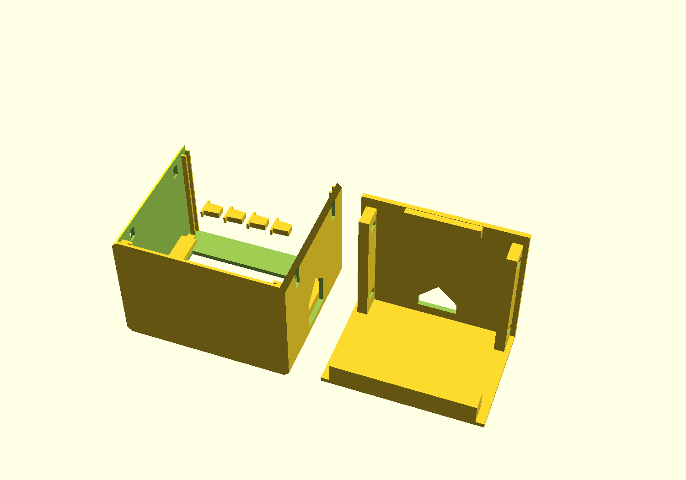
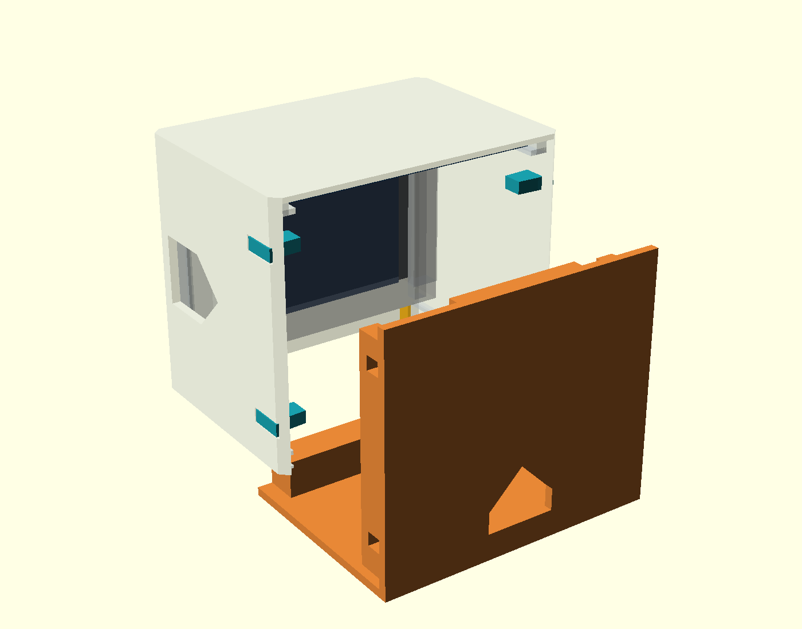

# NFC Jukebox enclosure rC

**Revised design; not yet physically tested.** Overall size: 70 × 50 × 60 mm
(width × depth × height), display at the front, RC522 at the top, PLA, no screws.
USB opening on the right when viewed from the display; the left side is closed.
Print both the body and drawer as rC: rB and rC parts are not mechanically compatible.


## Changes from rB

- Continuous display guides rooted in the side walls. Rear retaining lips overlap
  about 3.2 mm of the outer glass margin, up from about 0.9 mm.
- A broad display support replaces the two thin fingers: about 58.4 mm wide and
  7.7 mm deep, joined directly to the floor.
- Two separate clamp strips sit behind the outer glass margins to limit backward
  movement. Three thicknesses allow fit adjustment without reprinting the body.
  They stay outside the nominal display PCB envelope.
- Four solid keys are inserted from the sides to secure the upper and lower rear
  panel. Continuous ribs connect their seats to the floor and rear panel. The keys
  carry drawer pull-out loads across their shafts; a light press fit retains them
  sideways. There are no flexible PLA latch arms.

## Printable parts

| File | Contents / purpose |
|---|---|
| [body.stl](body.stl) | One body, already oriented front-face down |
| [drawer.stl](drawer.stl) | One floor/rear-panel assembly, floor down |
| [keys.stl](keys.stl) | Four identical keys, already laid flat |
| [clamp-strips-normal.stl](clamp-strips-normal.stl) | Left/right pair, nominal 0.15 mm remaining play |
| [clamp-strips-tight.stl](clamp-strips-tight.stl) | Thicker alternative, nominal zero remaining play |
| [clamp-strips-loose.stl](clamp-strips-loose.stl) | Thinner alternative, nominal 0.30 mm remaining play |
| [keys-loose.stl](keys-loose.stl) | Alternative if keys are too tight, shaft up to 0.15 mm narrower |

**Use only one set of strips and one set of keys.** STLs are already oriented for
printing; no automatic reorientation is needed. Starting settings: PLA, 0.4 mm
nozzle, 0.2 mm layers, four wall lines, five top/bottom layers and 20–30% infill.
The strips and keys will be mostly solid at these wall settings. Do not scale the
parts to adjust fit: scaling also changes the hardware dimensions.



Most overhangs grow at 45°. The four key holes leave short bridges: about 3.2–3.5 mm
in the body and about 5.2 mm in the drawer. The design targets printing without
supports; inspect these bridges and the first layer in your slicer. This is not a
guarantee for every printer. An external brim may help the narrow strips adhere.

## Assembly



1. Lay the body front-face down on a soft surface. Leave the keys out.
2. Slide the display through the open bottom into the front guides until it meets
   the upper stop. Glass rests against the bezel; connectors face inward.
3. Slide the normal clamp strips upward behind the outer glass margins: flat face
   toward the glass, sloping face toward the guide. They may slide down slightly
   until the floor is installed.
4. Slide the RC522 into the roof guides from the rear, antenna upward, soldered
   connections inward. Route wires through the free interior space.
5. Slide the drawer in from the rear. Its broad front support carries the display
   from below; the rear panel closes the body and forms the rear RC522 stop.
6. Insert the four keys from the outside into the aligned side holes, tapered shaft
   first, until their heads sit flush in the recesses.

If the display still moves, use the thicker **tight** strips. If assembly binds,
use the thinner **loose** strips. Do not force the glass. Fit depends on printer
accuracy, the first layer and actual glass thickness; nominal clearance does not
include printing deviations.

To open the enclosure, pull/pry the key heads out using the surrounding recesses,
then withdraw the drawer using its rear grip opening. This is a removable plug
connection, not a click latch. Retention force and removal convenience have not
been physically verified. The rear opening is a finger grip, not an extra port.

## Checks and limitations

[mesh-check.json](mesh-check.json) records [verify_meshes.py](verify_meshes.py):
all seven STLs are watertight, consistently oriented, have the expected number of
connected parts and positive volumes, and sit on the print bed. Body dimensions
in print orientation are 70 × 60 × 50 mm. Body and drawer have no volume overlap,
including 101 sampled positions along a 50 mm withdrawal path. Nominal glass,
display PCB and RC522 envelopes do not overlap those parts. Strips meet the sloping
guides; numerical intersection residue below 0.0001 mm³ is tolerated.

**Not yet verified:** an actual print, retention force, service life, real connector
and wire dimensions, and manufacturing tolerances of your boards. Board models
are simplified envelopes, not full component models.

## Edit the CAD / export again

[jukebox.scad](jukebox.scad), OpenSCAD 2021.01. `part` values: `body`, `drawer`,
`keys`, `strips`, `assembly`, `exploded`, `plate`. Strip clearance `fit`:
0 / 0.15 / 0.30 mm. Use `key_fit=-0.15` for loose keys.

```sh
openscad -D 'part="body"' -o body.stl jukebox.scad
openscad -D 'part="drawer"' -o drawer.stl jukebox.scad
openscad -D 'part="keys"' -o keys.stl jukebox.scad
openscad -D 'part="strips"' -D 'fit=0.15' -o clamp-strips-normal.stl jukebox.scad
python -m pip install trimesh numpy scipy manifold3d
python verify_meshes.py
```

Original CAD design: MIT; see the repository LICENSE.
